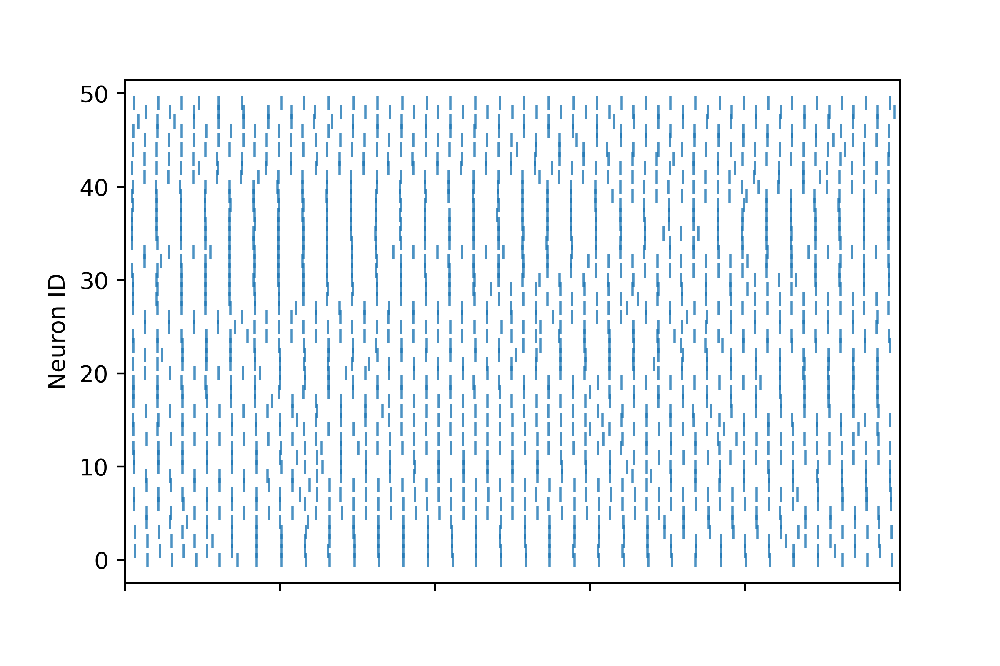
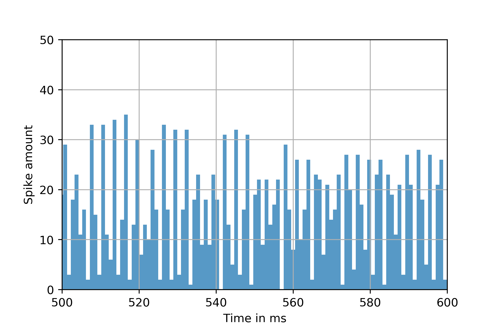
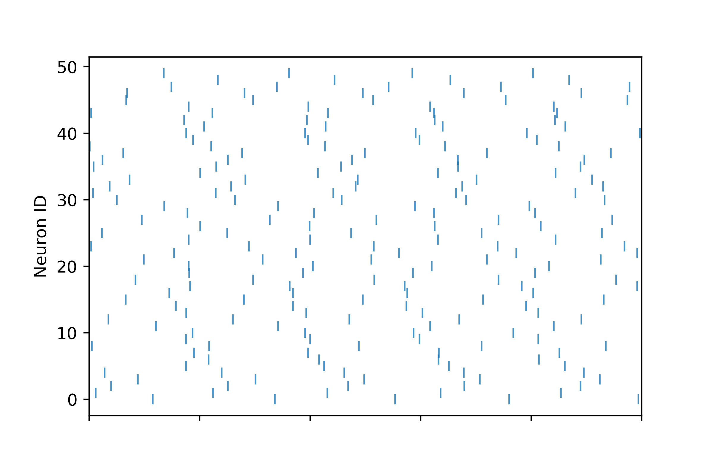
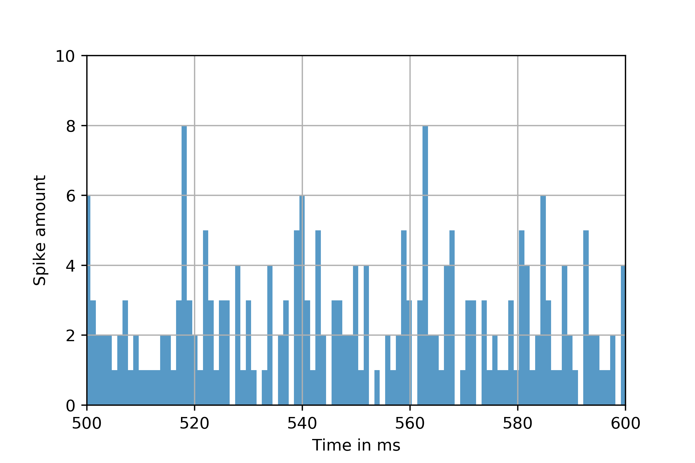
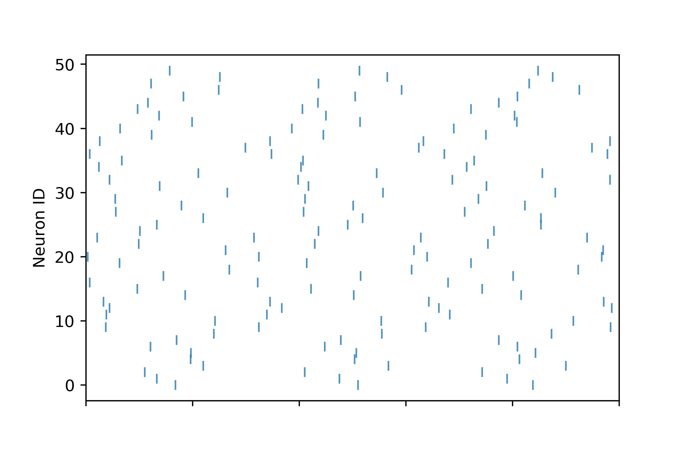
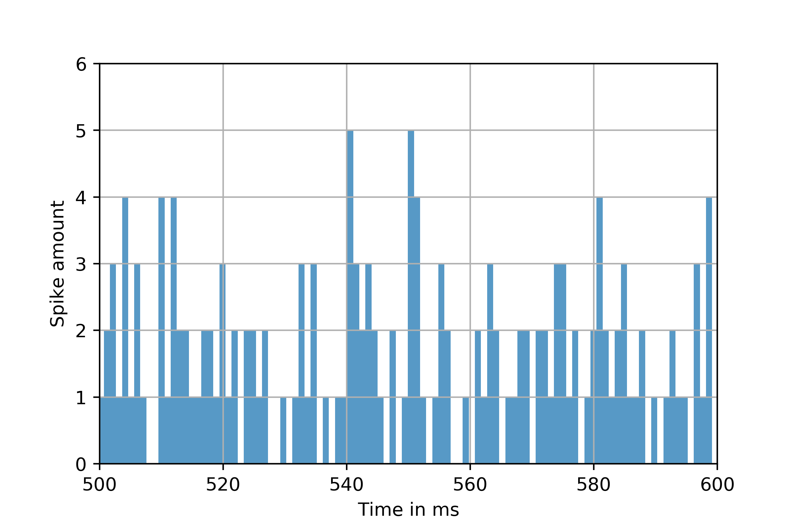
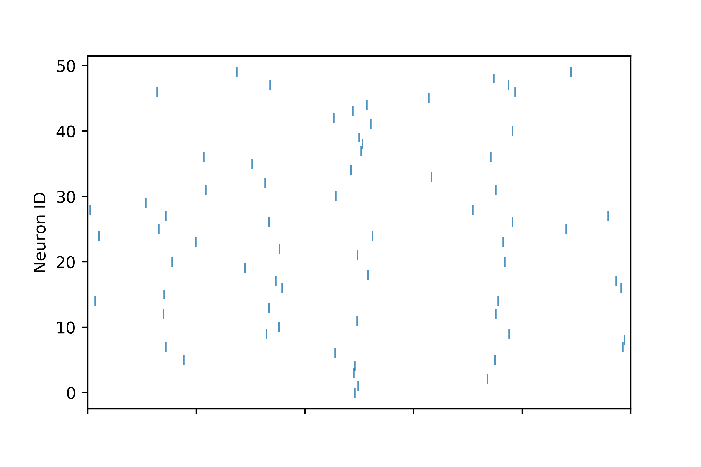
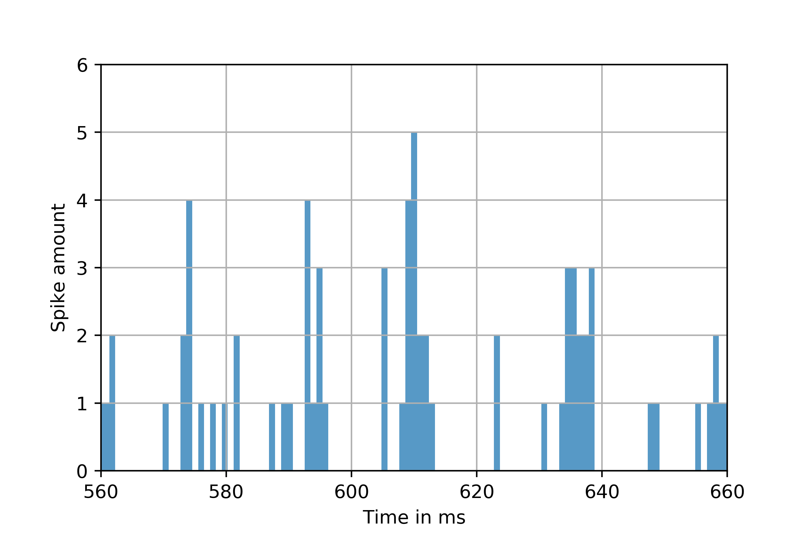

# cppcourse-brunel
### introduction
This program simulates a spiking neural network of 12500 neurons described in Nicolas Brunel's paper "Dynamics of Sparsely Connected Networks of Excitatory and Inhibitory Spiking Neurons".

The main objective is to be able to reproduce figure 8 found on page of the abovementioned paper. To do so, I've implemented a C++ program that outputs a data file containing the spiking times of 50 randomly chosen neurons.

### implementation documentation
All information concerning the C++ program can be found in the attributed Doxygen file. `cppcourse-brunel/html/index.html` Additional information about the simulation can be found in the paper.

### running the program
The program is automatically set to case C of figure 8. In order to reproduce all cases, constants G and ETA are to be changed in the `constants.h` file. Running the simulation will print out the number of average spikes per second as well as the total running time for a 1 second simulation.

How to run :

1. Clone git repository
2. Go to cppcourse-brunel file
3. Open terminal
4. type `cd build` in order to enter build folder (if folder does not exist, type in `mkdir build` beforehand)
5. type `cmake ../` as CMakeList is in main folder
6. type `make brunel` or `make bruneltest`
7. run `./brunel` or `./bruneltest`
8. Data file will be in build folder.
9. Extract data file before cleaning
10. To clean, type in `find . ! -name rasterplot.ipynb -delete` as all generated files are in build folder (we wish to keep the jupyter notebook, however)

### plot reproduction
In order to plot the data, I developed a jupyter notebook file creating two plots : a scatterplot and a histogram.

* The scatterplot shows the neuron ID (y-axis) depending on the spiking time (x-axis). In fact, every dot corresponds to one spike.

* The histogram shows the number of spikes for a given time interval (bins of 1 ms).

The results in this file are from my own jupyter notebook, but equivalent results could be obtained from either Prof. Gewaltig's jupyter notebook or Antoine Albertelli's web application [https://cs116-plot.antoinealb.net/]().

### jupyter notebook

here is the specific jupyter notebook I used. The ipynb file can be found in `cppcourse-brunel/results/rasterplot.ipynb` and in `cppcourse-brunel/build/rasterplot.ipynb`. I suggest running the notebook from the build file as it searches for the data in it's directory, and the data is saved in build directory.

#### rasterplot.ipynb


 
```python
import matplotlib.pyplot as plt
import numpy as np
```


```python
x, y = np.loadtxt('rasterdata.gdf', delimiter = '\t', unpack = True)
```


```python
fig,ax = plt.subplots(1)
ax.plot(x,y, "|", alpha=.8)
plt.xlim([500, 600])
plt.ylabel('Neuron ID')
ax.set_xticklabels([])
plt.savefig('fig.png', dpi = 400)
plt.show()
```
```python
plt.hist(x, 1000, rwidth=1, alpha=.75)
plt.xlim([500, 600])
plt.ylim([0,50])
plt.xlabel('Time in ms')
plt.ylabel('Spike amount')
plt.grid(True)
plt.savefig('hist.png', dpi = 400)
plt.show()
```

### results
*note : only 100 ms of total simulation (1000 ms) are shown for plot clarity*

* case A

 


Average spike number : 318.039 per second

* case B




Average spike number : 47.075 per second

* case C

 
 

Average spike number : 31.2985 per second

* case D

  
  

Average spike number : 14.3681 per second
